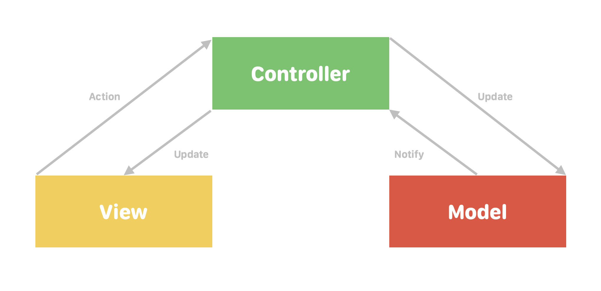
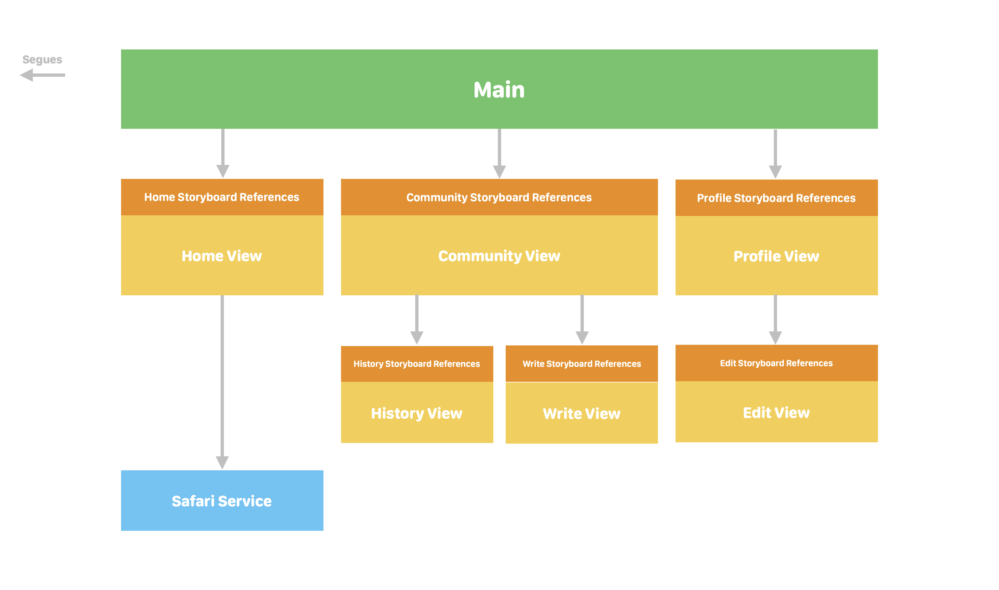

# NBCamp iOS

- [NBCamp 위키 바로가기](https://github.com/iiiiive/nbcamp-ios/wiki)

## Members

||||||
|:---:|:---:|:---:|:---:|:---:|
|[김유진](https://github.com/yujinkim1)|[김서진](https://github.com/seojinkim112211)|[이현우](https://github.com/hw-devlog)|[이애라](https://github.com/aera11)|[최영군](https://github.com/YoungKunChoi)|

## Architecture



## Application Layer



## File Structures

```bash
.
├── NBCamp
│   ├── Application
│   │   ├── AppDelegate.swift
│   │   └── SceneDelegate.swift
│   ├── Info.plist
│   ├── Model
│   │   ├── Mock.swift
│   │   ├── Post.swift
│   │   └── User.swift
│   ├── Presentation
│   │   ├── Community
│   │   │   ├── Storyboard
│   │   │   │   └── Community.storyboard
│   │   │   └── ViewController
│   │   │       └── CommunityViewController.swift
│   │   ├── Detail
│   │   │   ├── Storyboard
│   │   │   │   └── Detail.storyboard
│   │   │   └── ViewController
│   │   │       └── DetailViewController.swift
│   │   ├── Edit
│   │   │   ├── Storyboard
│   │   │   │   └── Edit.storyboard
│   │   │   └── ViewController
│   │   │       └── EditViewController.swift
│   │   ├── History
│   │   │   ├── Storyboard
│   │   │   │   └── History.storyboard
│   │   │   └── ViewController
│   │   │       └── HistoryViewController.swift
│   │   ├── Home
│   │   │   ├── Storyboard
│   │   │   │   └── Home.storyboard
│   │   │   └── ViewController
│   │   │       └── HomeViewController.swift
│   │   ├── Main
│   │   │   └── Storyboard
│   │   │       └── Main.storyboard
│   │   ├── Profile
│   │   │   ├── Storyboard
│   │   │   │   └── Profile.storyboard
│   │   │   └── ViewController
│   │   │       └── ProfileViewController.swift
│   │   └── Write
│   │       ├── Storyboard
│   │       │   └── Write.storyboard
│   │       └── ViewController
│   │           └── WriteViewController.swift
│   ├── Resource
│   │   ├── Assets.xcassets
│   │   │   ├── AppIcon.appiconset
│   │   │   ├── Contents.json
│   │   │   ├── Image
│   │   │   └── Palette
│   │   ├── Font
│   │   ├── Icon
│   │   ├── Image
│   │   └── LaunchScreen.storyboard
│   └── Utility
│       ├── ColorManager.swift
│       ├── DateTimeFormatter.swift
│       └── ExternalManager.swift
```
